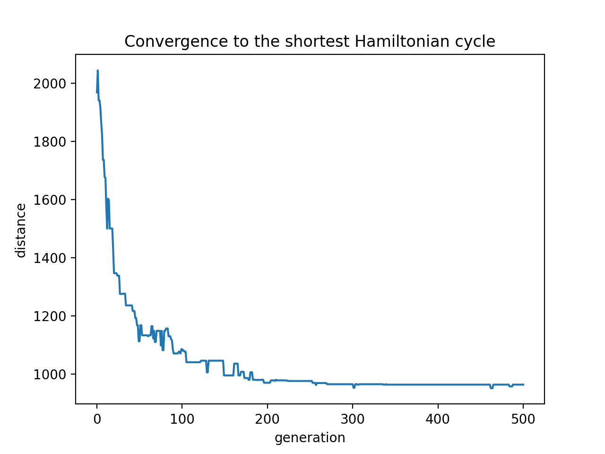
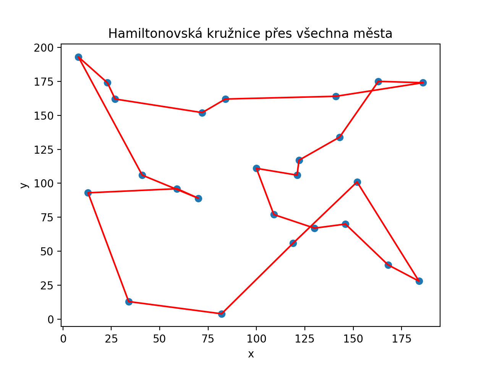

# Genetic-Algorithm-for-the-Travelling-Salesman-Problem

A Python implementation of a genetic algorithm for the Travelling Salesman Problem (TSP). The goal is to find a Hamiltonian cycle with the lowest total edge weight — i.e. the shortest closed route through all cities, visiting each city exactly once.

<p align="center">
  
  
</p>

## Problem Description

Consider a complete undirected weighted graph in which each node represents a city with coordinates (x,y) in the plane, and the weight of each edge is the Euclidean distance between the corresponding cities. The problem is NP-hard — no polynomial-time algorithm is known, which makes heuristics such as genetic algorithms a suitable approach.

## How the Algorithm Works


1. Initial population — popSize random Hamiltonian cycles (random permutations of cities) are generated.
2. Evaluation (fitness) — each cycle is scored as 1 / route length, turning the minimization problem into a maximization one.
3. Selection — the best individuals (an elite of size eliteSize) survive automatically; the remaining parents are chosen by roulette-wheel selection based on the cumulative fitness percentile.
4. Crossover — a random segment of the route is taken from one parent and the rest is filled in with the cities of the second parent in their original order (ordered crossover), so that no city is repeated.
5. Mutation — with probability mutationRate, two cities in the cycle swap positions, which helps escape local minima.
Steps 2–5 are repeated for generations.


## Requirements

Python module: Python 3.8+, pip install -r requirements.txt


## Usage

Open the notebook Travelling_Salesman_Problem.ipynb (Jupyter Lab / Jupyter Notebook) and run the cells from top to bottom:

The main entry point:

```
ham_cycle = geneticAlgorithm( 
    population=cityList,   # list of cities (City instances) 
    popSize=50,            # population size
    eliteSize=10,          # number of elite individuals
    mutationRate=0.01,     # mutation probability (per gene)
    generations=500        # number of generations
)
```

Runtime for 25 cities and 500 generations is approximately 10–15 s. To use random cities on each run, comment out the 25 fixed cities and uncomment the random generation above.


## Outputs

konvergence.png — convergence of the best distance in the population over generations \
ham.png — visualization of the resulting Hamiltonian cycle through all cities


The algorithm typically only approaches the optimum — due to its stochastic nature (mutation, roulette-wheel selection) it is not guaranteed to find the global minimum. Correct convergence can be verified on cities generated on a circle (optionally with added noise), where the optimal solution is known — see the appendix of the accompanying PDF.

## Project Structure

* Travelling_Salesman_Problem.ipynb          # genetic algorithm implementation
* TSP_Genetic_Algorithm_EN.pdf   # accompanying paper with the problem definition and algorithm description 
* README.md

## References

STOLTZ, Eric. Evolution of a salesman: A complete genetic algorithm tutorial for Python. Towards Data Science, 2018. (code base, adapted and extended) \
ZELINKA, Ivan. Evoluční výpočetní techniky: principy a aplikace. Prague: BEN — technická literatura, 2009. ISBN 978-80-7300-218-3.
